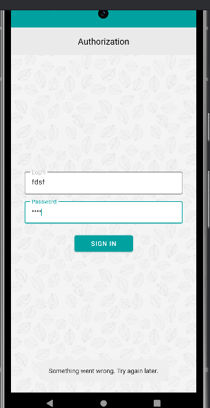
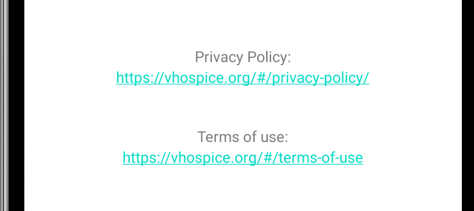

1. # Некорректный текст ошибки при вводе неверных учетных данных
 * Шаги воспроизведения:
  1. Запустить приложение
  2. В поле "Login" и "Password" ввести произвольные значения
  3. Нажать кнопку "Sign in"
   _Ожидаемый результат_: Отображается ошибка "Wrong login or password"
   _Фактический результат_: Отображается ошибка "Something went wrong. Try again later."
   _Скриншот_: []
   
2. # Неактивность кнопки "About" при нахождении в меню "News"
 * Шаги воспроизведения:
  1. Открыть приложенение
  2. Пройти авторизацию
  3. Перейти в раздел "News"
  4. Перейти в раздел "About"
   _Ожидаемый результат_: Из раздела "News" переходим в раздел "About"
   _Фактический результат_: Кнопка перехода в раздел "About" не активна
   _Скриншот_: []
   
3. # Некорректная ссылка перехода на внешний ресурс для ознакомления с политикой конфиденциальности
 * Шаги воспроизведения:
  1. Открыть приложение
  2. Пройти авторизацию
  3. Перейти в раздел "About"
  4. Перейти по ссылке "Thermal of use"
   _Ожидаемый результат_: Ссылка активна и ведет на сайт ознакомления с политикой конфиденциальности
   _Фактический результат_: Ссылка активна,но не открывается в браузере сайт ознакомления с политикой конфиденциальности
   _Скриншот_: []
   
4. # Некорректная ссылка перехода на внешний ресурс для ознакомления с пользовательскими соглашениями
 * Шаги воспроизведения:
  1. Открыть приложение
  2. Пройти авторизацию
  3. Перейти в раздел "О приложении"
  4. Перейти по ссылке "Privacy Policy"
   _Ожидаемый результат_: Ссылка активна и ведет на сайт ознакомления с пользовательскими соглашениями
   _Фактический результат_: Ссылка активна,но не открывается в браузере сайт ознакомления с пользовательскими соглашениями
   _Скриншот_: []

5. # Некорректное поевдение при вводе корректных учетных данных с пробелом в конце
 * Шаги воспроизведения:
  1. Запустить приложение
  2. В поле "Login" и "Password" ввести предоставленные учетные данные, в конце поставить знак пробела
  3. Нажать кнопку "Sign in"
   _Ожидаемый результат_: Отображается ошибка "Wrong login or password"
   _Фактический результат_: Происходит авторизация приложения

6. # Некорректное поевдение при вводе корректных учетных данных с пробелом в начале
 * Шаги воспроизведения:
  1. Запустить приложение
  2. В поле "Login" и "Password" поставить знак пробела, затем ввести предоставленные учетные данные
  3. Нажать кнопку "Sign in"
   _Ожидаемый результат_: Отображается ошибка "Wrong login or password"
   _Фактический результат_: Происходит авторизация приложения

7. # Некорректное поевдение при вводе учетных неправильных данных, аналогичных корректным
 * Шаги воспроизведения:
  1. Запустить приложение
  2. В поле "Login" и "Password" ввести предоставленные учетные данные, последний символ логина и пароля заменить на другую цифру
  3. Нажать кнопку "Sign in"
   _Ожидаемый результат_: Отображается ошибка "Wrong login or password"
   _Фактический результат_: Происходит авторизация приложения
